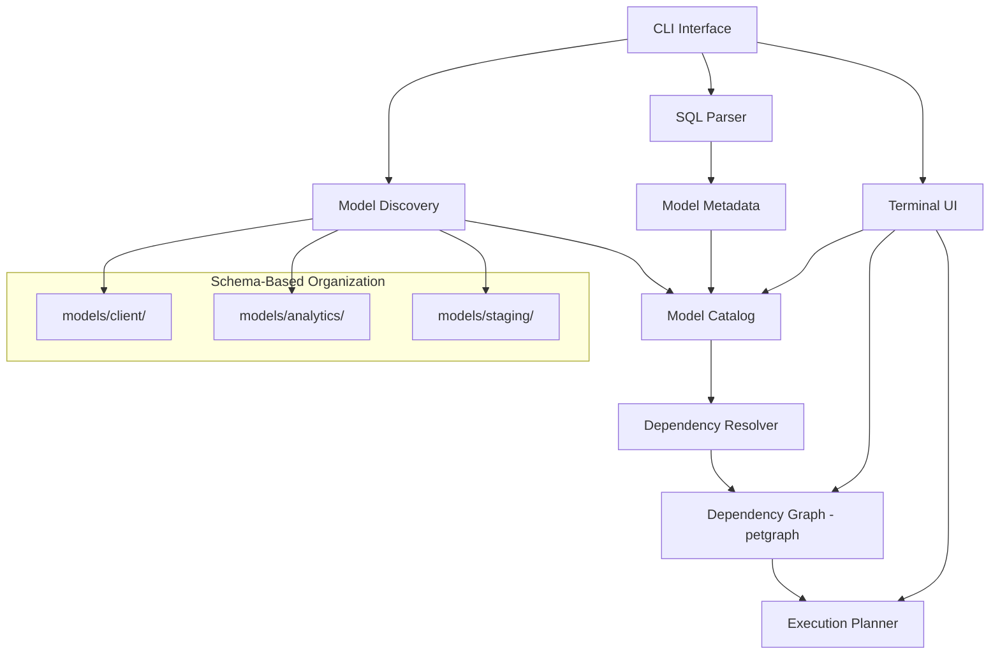

# System Patterns: CADAC

## System Architecture



### Core Components

1. **CLI Interface**: Entry point for the application, handles command-line arguments and user input
2. **SQL Parser**: Uses tree-sitter to parse SQL queries and extract metadata
3. **Model Metadata**: Structures for representing data models, columns, and sources
4. **Model Discovery**: Finds SQL files and builds a catalog of models
5. **Model Catalog**: Repository of data models and their metadata
6. **Dependency Graph**: Represents relationships between models
7. **Terminal UI**: Interactive interface for exploring and managing the data catalog

## Key Technical Decisions

### 1. Tree-sitter for SQL Parsing
- **Decision**: Use tree-sitter for parsing SQL queries
- **Rationale**: Tree-sitter provides robust parsing capabilities with error tolerance and incremental parsing
- **Impact**: Enables accurate extraction of metadata from SQL queries with detailed AST traversal
- **Current Status**: Basic parsing works, but metadata extraction needs improvement

### 2. File-based Model Discovery
- **Decision**: Implement file-based model discovery with recursive directory traversal
- **Rationale**: Allows for flexible organization of SQL models in directories
- **Impact**: Enables automatic discovery and cataloging of models from file system
- **Current Status**: Basic discovery implemented, dependency tracking planned

### 3. Terminal UI with Ratatui
- **Decision**: Use Ratatui for the terminal user interface
- **Rationale**: Ratatui provides a modern, feature-rich framework for building terminal UIs in Rust
- **Impact**: Enables creation of an intuitive, responsive interface for interacting with the data catalog
- **Current Status**: Planned for implementation after core functionality is complete

### 4. Test-Driven Development
- **Decision**: Follow TDD principles for implementation
- **Rationale**: Ensures code quality and correctness from the start
- **Impact**: Comprehensive test suite that guides implementation
- **Current Status**: Tests implemented for parser and discovery components

### 5. Error Handling with color-eyre
- **Decision**: Use color-eyre for error handling
- **Rationale**: color-eyre provides rich, colorful error reports with context and backtraces
- **Impact**: Improves developer and user experience when dealing with errors
- **Current Status**: Implemented throughout the codebase

### 6. petgraph for Dependency Management
- **Decision**: Use petgraph library for dependency graph algorithms
- **Rationale**: Proven, battle-tested graph algorithms instead of rolling our own
- **Impact**: Robust cycle detection, topological sorting, and graph traversal
- **Current Status**: Selected for implementation, not yet integrated

### 7. Schema-Based Folder Organization
- **Decision**: Map folder structure to database schema (models/schema/table.sql → schema.table)
- **Rationale**: Natural organization that mirrors database structure, environment portability
- **Impact**: Clean SQL with no templating, automatic schema inference from file location
- **Current Status**: Architectural decision made, implementation pending

### 8. Pure SQL Approach
- **Decision**: Support only standard SQL with no templating or special syntax
- **Rationale**: Avoid dbt-style templating, keep SQL readable and portable
- **Impact**: Dependency resolution through intelligent parsing, not template references
- **Current Status**: Core principle established, guides all implementation decisions

## Design Patterns in Use

### 1. Trait-based Polymorphism
- **Pattern**: Define behavior through traits (e.g., `ModelParser`)
- **Implementation**: The `ModelParser` trait defines the interface for parsing SQL models
- **Benefits**: Enables flexible implementation of parsing logic and potential for alternative parsers
- **Example**:
  ```rust
  pub trait ModelParser {
      fn parse_model(&mut self, sql: &str) -> Result<&Self, ModelParseError>;
  }
  
  impl ModelParser for ModelMetadata {
      fn parse_model(&mut self, sql: &str) -> Result<&Self, ModelParseError> {
          // Implementation
      }
  }
  ```

### 2. Builder Pattern
- **Pattern**: Construct complex objects step by step
- **Implementation**: `ModelMetadata` is built incrementally during SQL parsing
- **Benefits**: Simplifies construction of complex metadata structures from parsed SQL
- **Example**:
  ```rust
  // Building ModelMetadata through incremental updates
  fn process_node(&mut self, node: &Node, source_bytes: &[u8]) {
      match node.kind() {
          NODE_KIND_FROM_CLAUSE => {
              self.extract_sources_from_clause(node, source_bytes);
          },
          NODE_KIND_SELECT_LIST => {
              self.extract_columns_from_select_list(node, source_bytes);
          },
          // Other node types
      }
  }
  ```

### 3. Visitor Pattern
- **Pattern**: Separate algorithms from object structures
- **Implementation**: Tree traversal in the SQL parser visits nodes and processes them based on type
- **Benefits**: Cleanly separates node traversal from node processing logic
- **Example**:
  ```rust
  fn walk_tree(&mut self, n: Node, source_bytes: &[u8]) {
      // Process current node
      self.process_node(&n, source_bytes);
      
      // Traverse children
      let mut cursor = n.walk();
      if cursor.goto_first_child() {
          // Process children recursively
      }
  }
  ```

### 4. Repository Pattern
- **Pattern**: Centralize data access logic
- **Implementation**: `ModelCatalog` manages a collection of models
- **Benefits**: Provides a clean API for model discovery and management
- **Example**:
  ```rust
  pub struct ModelCatalog {
      pub models: HashMap<String, ModelMetadata>,
      pub model_dir: PathBuf,
  }
  
  impl ModelCatalog {
      pub fn discover_models(&mut self) -> Result<()> {
          // Implementation
      }
  }
  ```

### 5. Error Type Pattern
- **Pattern**: Define domain-specific error types
- **Implementation**: `ModelParseError` enum with variants for different error cases
- **Benefits**: Provides clear, typed error handling
- **Example**:
  ```rust
  #[derive(Debug, PartialEq)]
  pub enum ModelParseError {
      ParseError(String),
      MultipleStatements(usize),
  }
  
  impl std::error::Error for ModelParseError {}
  ```

## Component Relationships

### SQL Parser and Model Metadata
- Parser extracts information from SQL queries
- Information is organized into ModelMetadata structures
- ModelMetadata represents data models with columns and sources

### Model Discovery and Model Catalog
- Discovery component finds SQL files in the file system
- Each SQL file is parsed to create a ModelMetadata instance
- ModelMetadata instances are stored in the ModelCatalog
- Catalog provides access to all discovered models

### Model Catalog and Dependency Graph
- Catalog contains all discovered models
- Dependency graph is built from source/target relationships in models
- Graph represents the execution order for models

### CLI and Terminal UI
- CLI processes command-line arguments
- Terminal UI provides interactive interface
- Both components interact with the model catalog and dependency graph

## Critical Implementation Paths

### SQL Parsing Flow
1. Parse SQL string using tree-sitter
2. Traverse the syntax tree recursively
3. Extract metadata about models, columns, and sources
4. Validate the extracted metadata
5. Return the populated ModelMetadata

### Model Discovery Flow
1. Find all SQL files in the specified directory (recursively)
2. For each SQL file:
   a. Extract model name from filename
   b. Read SQL content
   c. Parse SQL to create ModelMetadata
   d. Add model to catalog
3. Build dependency graph from model relationships

### Dependency Tracking Flow (Planned)
1. For each model in the catalog:
   a. Identify source tables referenced in the model
   b. Match source tables to other models in the catalog
   c. Create directed edges in the dependency graph
2. Validate the graph for cycles or missing dependencies
3. Determine execution order based on dependencies

### User Interaction Flow (Planned)
1. Process command-line arguments
2. Initialize the terminal UI
3. Render the model catalog and dependency graph
4. Handle user input events for navigation and selection
5. Execute selected models based on dependencies
6. Update the display with execution results
