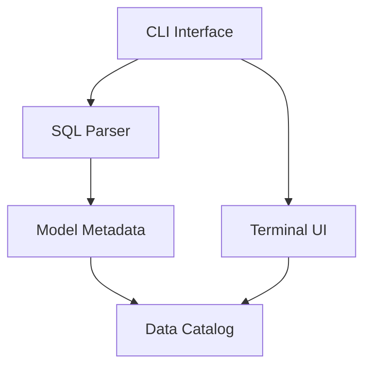

# System Patterns: CADAC

## System Architecture

### Core Components

1. **CLI Interface**: Entry point for the application, handles command-line arguments and user input
2. **SQL Parser**: Uses tree-sitter to parse SQL queries and extract metadata
3. **Model Metadata**: Structures for representing data models, columns, and sources
4. **Terminal UI**: Interactive interface for exploring and managing the data catalog
5. **Data Catalog**: Repository of data assets and their metadata

## Key Technical Decisions

### 1. Tree-sitter for SQL Parsing
- **Decision**: Use tree-sitter for parsing SQL queries
- **Rationale**: Tree-sitter provides robust parsing capabilities with error tolerance and incremental parsing
- **Impact**: Enables accurate extraction of metadata from SQL queries with detailed AST traversal

### 2. Terminal UI with Ratatui
- **Decision**: Use Ratatui for the terminal user interface
- **Rationale**: Ratatui provides a modern, feature-rich framework for building terminal UIs in Rust
- **Impact**: Enables creation of an intuitive, responsive interface for interacting with the data catalog

### 3. Command-line Arguments with Clap
- **Decision**: Use Clap for parsing command-line arguments
- **Rationale**: Clap is a mature, feature-complete library for handling command-line arguments in Rust
- **Impact**: Simplifies implementation of CLI commands and options

### 4. Error Handling with color-eyre
- **Decision**: Use color-eyre for error handling
- **Rationale**: color-eyre provides rich, colorful error reports with context and backtraces
- **Impact**: Improves developer and user experience when dealing with errors

## Design Patterns in Use

### 1. Trait-based Polymorphism
- **Pattern**: Define behavior through traits (e.g., `ModelParser`)
- **Implementation**: The `ModelParser` trait defines the interface for parsing SQL models
- **Benefits**: Enables flexible implementation of parsing logic and potential for alternative parsers

### 2. Builder Pattern
- **Pattern**: Construct complex objects step by step
- **Implementation**: `ModelMetadata` is built incrementally during SQL parsing
- **Benefits**: Simplifies construction of complex metadata structures from parsed SQL

### 3. Visitor Pattern
- **Pattern**: Separate algorithms from object structures
- **Implementation**: Tree traversal in the SQL parser visits nodes and processes them based on type
- **Benefits**: Cleanly separates node traversal from node processing logic

### 4. Command Pattern
- **Pattern**: Encapsulate requests as objects
- **Implementation**: CLI commands are represented as structs with their own arguments
- **Benefits**: Modular command implementation with clear separation of concerns

## Component Relationships

### SQL Parser and Model Metadata
- Parser extracts information from SQL queries
- Information is organized into ModelMetadata structures
- ModelMetadata represents data models with columns and sources

### CLI and Terminal UI
- CLI processes command-line arguments
- Terminal UI provides interactive interface
- Both components interact with the data catalog

## Critical Implementation Paths

### SQL Parsing Flow
1. Parse SQL string using tree-sitter
2. Traverse the syntax tree
3. Extract metadata about models, columns, and sources
4. Validate the extracted metadata
5. Store the metadata in the catalog

### User Interaction Flow
1. Process command-line arguments
2. Initialize the terminal UI
3. Render the interface
4. Handle user input events
5. Update the display based on user actions
